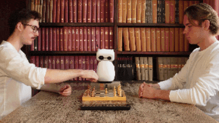

# robot-chess-commentator
This codebase enables a [Reachy Mini](https://huggingface.co/blog/reachy-mini) robot to commentate chess games. It recognises moves with 94.6% first-try accuracy, and then generates move-specific comments.
<p align="center">
  
</p>

## Layout

The package is `chess_commentator`, under `src/`. `main.py` orchestrates various package parts to let the robot commentate games:
| | |
| --- | --- |
| **During a game** | |
| _Set up_| |
| `session.py` | orientate robot towards chess board; locate chess board corners in camera image  |
| `game.py` | keep track of the board position |
| _For each move_ | |
| `player_input.py` | register moves and move announcement rejections via keyboard or robot antennas |
| `perception/` | capture and warp images; cut out 64 inputs for square classifier; call on square classifier to classify squares |
| `game.py/` | estimate move from square classification results; use chess engine to rate move |
| `voice/` | announce move; generate move comment text; turn text into audio using Kokoro TTS |
| | |
| **Other parts of the package** | |
| `cnn/` | train and evaluate 1.3 MB convolutional neural network for square classification |
| `dataset/` | facilitate creation of dataset comprising 23,744 labeled images of chess squares via useful interface |
| `vlm/` | use various Claude versions and prompts to recognise moves |
| `benchmark/` | generate evaluation results for different CNN-powered and Claude-powered move recognition approaches |
| `board.py` and `labels.py` | shared vocabulary for chess squares, pieces and classification scores |

Next to the package, the repo also includes
- `demo/`: demonstrate move recognition system via demo script - can be run without a robot _(see [Demo](#demo))_
- `evaluation/`: store and analyse eval results created via `chess_commentator.benchmark.harness; see the [evaluation page]([url](https://github.com/felixfabricius/robot-chess-commentator/tree/main/evaluation)) for eval methodology and results
- `weights/`: shipped model; also available via HuggingFace under _**insert license**_ and _**provide url**_
- `tests/`: mirrors package structure; does not require robot or API keys
- `config.yaml`: various knobs


## How to use
### Demo
To run the move recognition pipeline in just a few minutes, check out the
[demo](demo/) — ***no robot required***. It lets you
- transform a chess board image into 64 inputs for the convolutional neural net (CNN)
- use the CNN to estimate which pieces the squares host; and predict the most likely moves
  based on those estimates
- evaluate how well the CNN was able to estimate square occupancy, and whether moves were
  recognised correctly

To run:
1. Clone the repository:
   ```bash
   git clone https://github.com/felixfabricius/robot-chess-commentator.git
   ```
2. [Install uv](https://docs.astral.sh/uv/getting-started/installation/); then download the
   required packages:
   ```bash
   uv sync
   ```
3. Run the demo from the repo root:
   ```bash
   uv run python demo/demo.py
   ```
   (add `--pause` to step through it one stage at a time)

### Commentate chess games
If you have a Reachy Mini robot at hand and running, you can let it commentate chess games.
1. Clone the repository:
   ```bash
   git clone https://github.com/felixfabricius/robot-chess-commentator.git
   ```
2. [Install uv](https://docs.astral.sh/uv/getting-started/installation/); then download the
   required packages, incl. the robot-specific ones (e.g. the Reachy Mini SDK):
   ```bash
   uv sync --group robot
   ```
3. Create a `.env` file in the repo root with an Anthropic API key, which is used to generate comment texts.
   ```
   ANTHROPIC_API_KEY=sk-ant-...
   ```
4. Install [Stockfish](https://stockfishchess.org/download/) and point `engine.stockfish_path` in `config.yaml` at the binary. (Alternatively, just ensure Stockfish is on your PATH.) Required for rating moves.
5. **_Optional_**: pregenerate the audio fragments which constitute move announcements, like "E2 to E4?". This takes around 5-8 minutes and reduces time per move announcement by around a second.
   ```bash
   uv run python -m chess_commentator.voice.pregenerate
   ```
6. Start the game loop:
   ```bash
   uv run --group robot python -m chess_commentator.main
   ```

### Train and evaluate your own move recognition system
In case you'd like to train your own model to classify individual squares, the dataset with
23,744 labeled chess square images is openly available on Hugging Face under CC-BY-4.0 _**(insert link**_. So is the model, Apache-2.0, which you can check out for reference.

The `chess_commentator.cnn` package under src/ might prove a useful starting point. `chess_commentator.cnn.run` orchestrates training and evaluation.  

## Contributions
Comments, ideas and PRs welcome! Feel free to leave comments via LinkedIn or Substack. 

## License

This project ships three things under different licenses:
| Artifact | License | Reason |
| --- | --- | --- |
| Source code | [GPL-3.0-or-later](LICENSE) | project depends on [python-chess](https://github.com/niklasf/python-chess), which is GPL-3.0-or-later |
| Bundled model weights (`weights/`) | [Apache-2.0](weights/LICENSE) | weights are the output of the training code, so the GPL does not reach them |
| Training dataset (on Hugging Face, not in this repo) | CC-BY-4.0 | sharing and adapting encouraged :) |


Copyright © 2026 Felix Fabricius.
